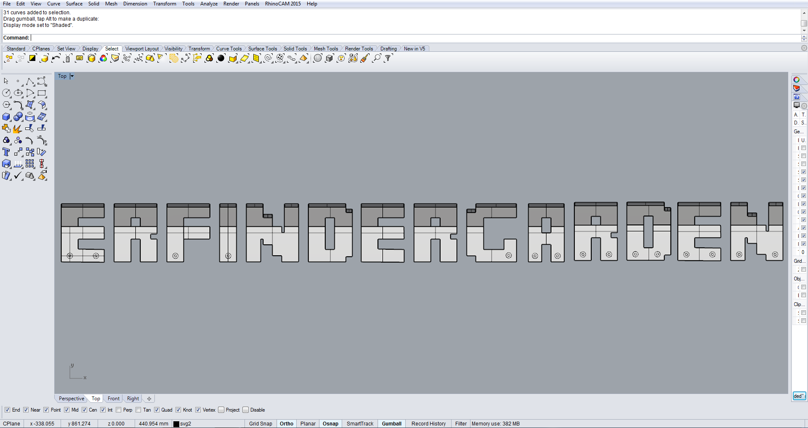

# erfindergarden-clothhangers
Here are the erfindergarden clothes hangers letters we have since last year.

They look awesome but they are not very practical.

 [Here](http://a360.co/2oLoTly) is the fusion link.

## How you can help?

* make a cloth hanger yourself
* share your makes with us at 
* redesign the hangers in fusion 

## Designer

Kat Labrou

## Contact erfindergarden

Andreas Kopp

[andreas@erfindergarden.de](mailto:andreas@erfindergarden.de)

[www.erfindergarden.de](http://www.erfindergarden.de)

[www.facbebook.com/erfindergarden](http://www.facbebook.com/erfindergarden)

## Credits
 
Thanks Kenny for the design. 

## Licence

This project is [Attribution-ShareAlike 2.5 Generic (CC BY-SA 2.5)](https://creativecommons.org/licenses/by-sa/2.5/). You can do anything what you want with it but please say that you got the original design from erfindergarden and als share it under the same license. 

For more information, see [license](license.md). 